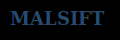

# Welcome to Malsift Documentation

{ width="300" }

## 🚀 Cyber Threat Intelligence Aggregation Platform

Malsift is a comprehensive cyber threat intelligence aggregation platform designed to collect, normalize, and manage threat indicators from multiple sources. Built for on-premise deployment with AWS migration capabilities, Malsift provides advanced deduplication, dark web monitoring, and flexible exclusion management.

## 🎯 Key Features

### Multi-Source Intelligence Aggregation
- **Government Sources**: CISA Known Exploited Vulnerabilities, FBI Cyber Division feeds, DHS Automated Indicator Sharing
- **Open Source Sources**: AlienVault OTX, MISP, OpenPhish, PhishTank, URLhaus (Abuse.ch)
- **Commercial Sources**: VirusTotal, ThreatFox, IBM X-Force Exchange, Recorded Future, CrowdStrike Falcon (free tiers)
- **Custom Feed Support**: Add any threat intelligence source with custom parsers

### Advanced Deduplication System
- **Intelligent Normalization**: IP addresses, domains, URLs, hashes, emails
- **Confidence Score Merging**: Automatically merges duplicate indicators with highest confidence
- **Tag Consolidation**: Combines tags and metadata from multiple sources
- **Duplicate Tracking**: Comprehensive reporting on duplicate detection and resolution

### Dark Web Monitoring
- **Tor Integration**: Built-in Tor proxy support for dark web access
- **Configurable Scraping**: Set custom intervals and source management
- **Content Extraction**: Advanced parsing and indicator extraction from dark web content
- **Source Management**: Add, configure, and monitor dark web sources

### Machine Learning & AI
- **Threat Scoring**: ML-based threat level assessment and prioritization
- **Anomaly Detection**: Identify unusual patterns and potential threats
- **Feature Engineering**: Advanced feature extraction from threat data
- **Model Management**: Train, update, and monitor ML models

### Modern Web Interface
- **React + TypeScript**: Modern, responsive frontend with Tailwind CSS
- **Real-time Dashboard**: Live statistics and threat level distributions
- **Advanced Filtering**: Search, filter, and sort indicators by multiple criteria
- **Feed Management**: Visual interface for managing threat intelligence sources

## 🚀 Quick Start

1. **Installation**: Follow the [Installation Guide](installation.md)
2. **First Run**: Complete the [Quick Start Guide](quick-start.md)
3. **API Reference**: Explore the [API Documentation](api/overview.md)

## 📚 Documentation Sections

### Getting Started
- [Installation](installation.md) - Complete setup instructions
- [Quick Start](quick-start.md) - Get up and running quickly

### API Reference
- [Overview](api/overview.md) - API documentation overview

## 🤝 Contributing

We welcome contributions! Please see our [Contributing Guide](../CONTRIBUTING.md) for details.

## 📄 License

This project is licensed under the MIT License - see the [LICENSE](../LICENSE) file for details.

## 🆘 Support

- **Documentation**: This site contains comprehensive documentation
- **Issues**: Report bugs and feature requests on [GitHub](https://github.com/rebaker501/malsift/issues)
- **Discussions**: Join the conversation on [GitHub Discussions](https://github.com/rebaker501/malsift/discussions)
